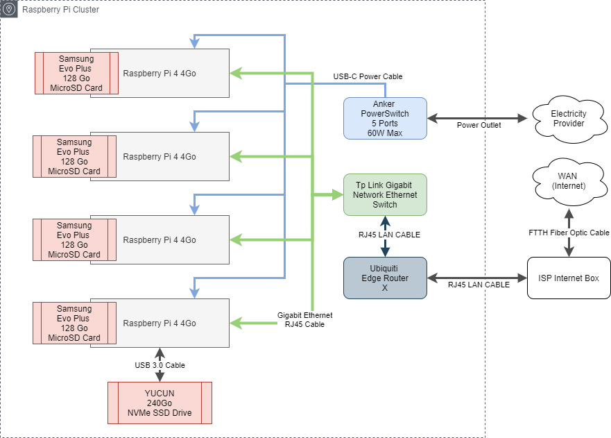

# Raspberry Cluster
Raspberry PI4 4Go Cluster for a DevOps Global Project

> If you have the hardware and the same Hardware architecture up & running, then you can go to the software part repository : 
> https://github.com/armandleopold/raspberry-install-scripts

# Hardware : 

* [4x raspberry pi 4Go](https://www.amazon.fr/gp/product/B07TC2BK1X/ref=ppx_yo_dt_b_asin_title_o03_s00?ie=UTF8&psc=1) 4*64€ = 256€
* [PowerPort USB Anker](https://www.amazon.fr/gp/product/B072K4TB67/ref=ppx_yo_dt_b_asin_title_o03_s02?ie=UTF8&psc=1) 29.99€
* [4x USB C Power Cables](https://www.amazon.fr/gp/product/B07GWF92B5/ref=ppx_yo_dt_b_asin_image_o03_s02?ie=UTF8&psc=1) 9.99€
* [TP Link Switch 5 Gigabit Ethernet](https://www.amazon.fr/gp/product/B00A128S24/ref=ppx_yo_dt_b_asin_title_o03_s01?ie=UTF8&psc=1) 15.95€
* [GeeekPi Case](https://www.amazon.fr/gp/product/B07Z4GRQGH/ref=ppx_yo_dt_b_asin_title_o03_s00?ie=UTF8&psc=1) 19.99€
* [5x Cat6 RJ46 Rankie Ethernet Cables](https://www.amazon.fr/gp/product/B01J8MDV5G/ref=ppx_yo_dt_b_asin_title_o03_s00?ie=UTF8&psc=1) 9.99€
* [4x Samsung Evo Plus 128Go MicroSD Card](https://www.amazon.fr/gp/product/B06XFHQGB9/ref=ppx_yo_dt_b_asin_title_o02_s00?ie=UTF8&psc=1) 4*23.48€ = 93.92€

**Total : 435.74€**

## Extra hardware :
* [Ubiquiti Edge Router X](https://www.amazon.fr/gp/product/B011N1IT2A/ref=ppx_yo_dt_b_asin_title_o01_s00?ie=UTF8&psc=1) 57.91€
* [Alxum NVMe M.2 Drive Case](https://www.amazon.fr/gp/product/B07SLHRHQG/ref=ppx_yo_dt_b_asin_title_o00_s00?ie=UTF8&psc=1) 42.99€
* [YUCUN NVMe 240Go SSD Drive](https://www.amazon.fr/gp/product/B07HVSF68X/ref=ppx_yo_dt_b_asin_title_o00_s01?ie=UTF8&psc=1) 39.99€

**Total : 140.89€**

**Big Total : 576.63**

# Infrastructure : 

